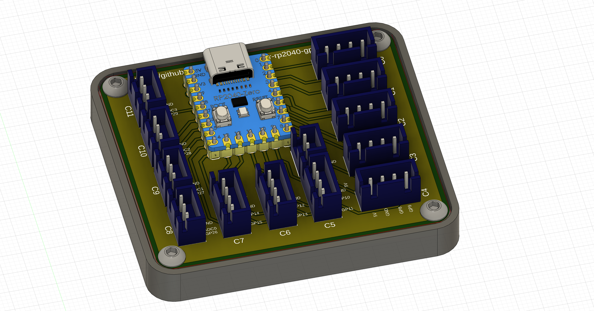
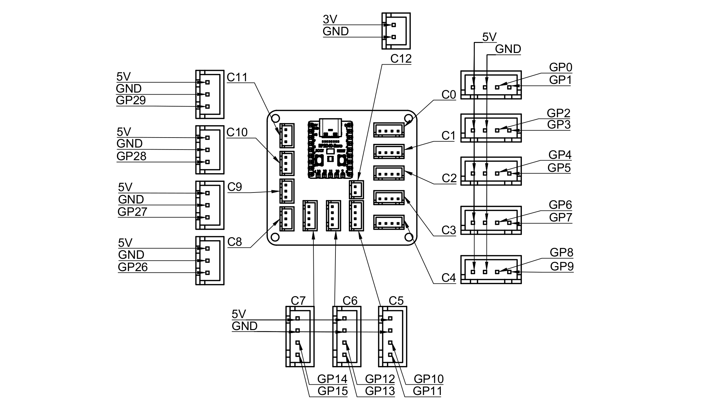
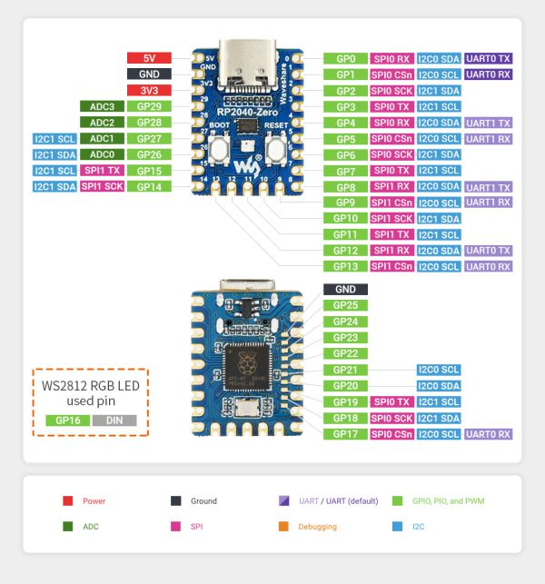

# Klipper RP2040 GPIO board



This is a small board that makes it convenient to connect additional sensors to your 3D printer running klipper, based on [RP2040-Zero](https://www.waveshare.com/wiki/RP2040-Zero). It exposes all available analog pins to 4-pin JST-XH headers, and digital pins to 3-pin JST-XH headers.

Features:
* Up to 20 analog pins (buttons, encoders, etc)
* Up to 4 digital pins (servos, hall sensors, thermistors, etc)
* 2 x SPI bus available
* 2 x I2C bus available

## BOM

| Name | Quantity | Description |
|---|---|---|
| PCB | 1 | Order online from your favorite PCB supplier (PCBWay, JLCPCB, etc). |
| RP2040-Zero | 1 | From [Waveshare](https://www.waveshare.com/rp2040-zero.htm) (also available on Aliexpress).
| JST-XH 4-pin | 8 | |
| JST-XH 3-pin | 4 | |
| JST-XH 2-pin | 1 | |
| M3 x heat set insert | 4 | Optional, only needed for the case. |
| M3 x 6mm | 4 | BHCS or SHCS screws. Optional, only needed for the case. |
| Case_bottom.stl | 1 | Optional, print if needed. |

## Klipper installation

Compile Klipper for the RP2040 board. The commands below are intended to be run on your printer host:
```sh
git clone --depth 1 --single-branch https://github.com/Klipper3d/klipper.git ~/klipper-rp2040-gpio
cd ~/klipper-rp2040-gpio
~/klippy-env/bin/python scripts/make_version.py `hostname`
# v0.11.0-146-ge2d7c598-mainsailos
make menuconfig
#                 Klipper Firmware Configuration
#  [*] Enable extra low-level configuration options
#      Micro-controller Architecture (Raspberry Pi RP2040)  --->
#      Bootloader offset (No bootloader)  --->
#      Flash chip (W25Q080 with CLKDIV 2)  --->
#      Communication interface (USB)  --->
#      USB ids  --->
#  ()  GPIO pins to set at micro-controller startup
make -j4
#   (...lots of output...)
#   Creating uf2 file out/klipper.uf2
ls -alh /dev/serial/by-id/usb-*
# lrwxrwxrwx 1 root root 13 Dec 18 15:53 /dev/serial/by-id/usb-RPI_rp2040_E66130100F5E3838-if00 -> ../../ttyACM1
make flash FLASH_DEVICE=/dev/serial/by-id/usb-RPI_rp2040_E66130100F798838-if00
ls -alh /dev/serial/by-id/usb-Klipper_rp2040*
# lrwxrwxrwx 1 root root 13 Dec 18 15:53 /dev/serial/by-id/usb-Klipper_rp2040_E66130100F5E3838-if00 -> ../../ttyACM1
```

#### Troubleshooting

* Problem: After flashing the board works fine, but after disconnecting/reconnecting the board it does not boot anymore.
* Solution: Run `make menuconfig` and select `Flash chip (GENERIC_03H with CLKDIV 4)`. See [this issue](https://github.com/raspberrypi/pico-sdk/issues/1304).

## Configuration example

Your specific configuration depends on what is connected to the gpio pins. Example of a minimal configuration:

```ini
[mcu rp2040]
# find with: ls -alh /dev/serial/by-id/usb-Klipper_rp2040*
serial: /dev/serial/by-id/usb-Klipper_rp2040_E66130100F5E3838-if00

[neopixel rp2040_rgb]
pin: rp2040:gpio16
#color_order: GRB
initial_GREEN: 1.0

####
# Add sensors below:

[gcode_button my_button]
pin: ~rp2040:gpio4
press_gcode:
  RESPOND TYPE=command MSG='GP4 pressed'

[pwm_tool my_tool]
pin: rp2040:gpio26
```

Pin `gpio16` can only be used as a neopixel since it is soldered to the RP2040-Zero.

Consult [klipper's configuration reference](https://www.klipper3d.org/Config_Reference.html) for information on how to configure specific sensors with klipper.

## Pinout





For more information, see [RP2040-Zero Wiki](https://www.waveshare.com/wiki/RP2040-Zero).
